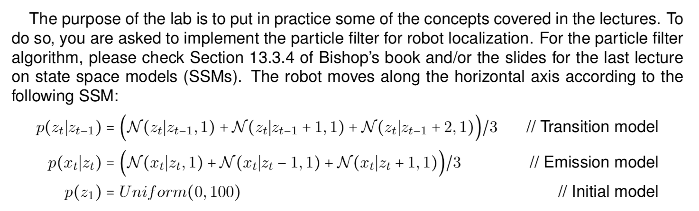
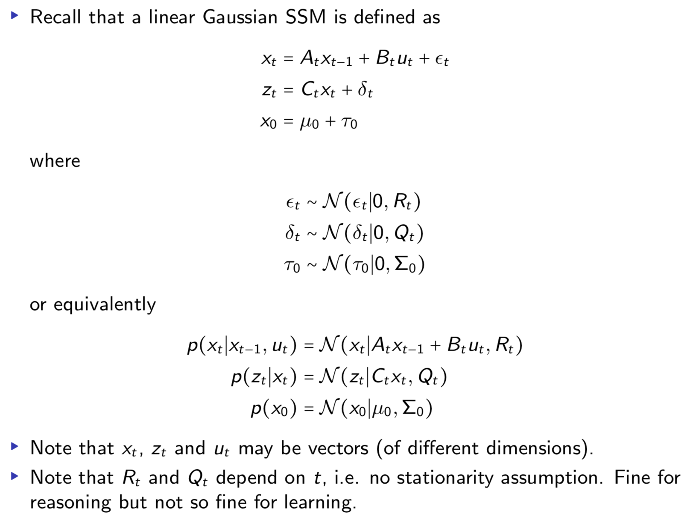

```{r setup, include=TRUE, results='hide', message=FALSE, warning=FALSE}

# Set up general options

knitr::opts_chunk$set(echo = FALSE, warning = FALSE, message = FALSE, 
                      fig.width=6, fig.height=5#, collapse=TRUE
                      )

set.seed(12345)
options(scipen=999)

# General libraries
library(ggplot2)
library(dplyr)

# Specific packages
library(HMM) # ls('package:HMM') # to show all functions
library(entropy)

```


```{r}

# Rstudio guide

## Setup
#```{r setup, include=TRUE, results='hide', message=FALSE, warning=FALSE}
#```

## Appendix
# ```{r, ref.label = knitr::all_labels(), echo = TRUE, eval = FALSE}
#```

## Add image
#```{r label, out.height = "400px", out.width = "800px"}
#knitr::include_graphics("image.png")
#```

## Add image
#

```

***

```{r out.height = "400px", out.width = "500px"}

```

```{r out.height = "400px", out.width = "500px"}

```

# Assignment 1: SSM Implementation and Particle Filtering

```{r echo=FALSE}

# ------------------------------------------------------------------------------
# Assignment 1
# ------------------------------------------------------------------------------
```

Implement the SSM above. Simulate it for $T = 100$ time steps to obtain $z_{1:100}$ (i.e., states) and $x_{1:100}$ (i.e., observations). Use the observations (i.e., sensor readings) to identify the state (i.e., robot location) via particle filtering. Use 100 particles. Show the particles, the expected location and the true location for the first and last time steps, as well as for two intermediate time steps of your choice.

***

Note: 

- $x_t$ is the hidden state
- $z_t$ is the observation

**Implementation SMM and Utility Functions**

```{r echo=TRUE}
# Sampling function for intial hidden states
init = function(n){
  runif(n, 0, 100)
}

# Sampling function for transition function
trans = function(x){
  
  state = sample(1:3, 1)
  if (state == 1){
    res = rnorm(1, x, 1)
  } else if (state == 2){
    res = rnorm(1, x+1, 1)
  } else {
    res = rnorm(1, x+2, 1)
  }
  return(res)
  
}

# Sampling function for emission function
emiss = function(x){
  
  state = sample(1:3, 1)
  if (state == 1){
    res = rnorm(1, x, 1)
  } else if (state == 2){
    res = rnorm(1, x-1, 1)
  } else {
    res = rnorm(1, x+1, 1)
  }
  return(res)
}

# Density of emission function
den_emis = function(z, x){
  (dnorm(z, x, 1) + dnorm(z, x-1, 1) + dnorm(z, x+1, 1))/3 
}

# Function to sample from SSM 
sample_SSM = function(){
  
  # Sample data from SSM
  T = 100
  set.seed(12345)
  
  x = numeric(length = T) # hidden states
  z = numeric(length = T) # observations
  x[1] = runif(1, 0, 100) # initial state generated with initial model
  z[1] = emiss(x[1]) # initial observation generated with emission model
  
  # Sample all the remaining states and observations
  for (t in 2:T){
    
    # sample next state with transition model (given previous hidden states)
    x[t] = trans(x[t-1])
    
    # sample observation with emission model (given current hidden state)
    z[t] = emiss(x[t])
  }
  
  return(list(z = z, x = x))
  
}

# Function to plot the true, believed hidden states and observations
plot_states = function(true_states, believed_states, observations){
  t = 1:length(observations)
  plot(t, x, col = "green", cex = 0.5,
       main = "True states (green), believed states (blue), obs. (blue)",
       ylab = "value", ylim = c(min(x, res$x, z), max(x, res$x, z)))
  points(t, res$x, col = "blue", cex = 0.5)
  points(t, z, col = "red", cex = 0.5, type = "o")
}

# Function to plot the particles
plot_particles = function(bel_out) {
  
  par(mfrow=c(2,2))
  t = 1
  hist(bel_out[[t]], main = paste0("Particles at t = ", t), breaks = 20)
  abline(v = res$x[t], col = "blue", lwd = 2, lty = 2)
  abline(v = x[t], col = "green", lwd = 2)
  
  t = 25
  hist(bel_out[[t]], main = paste0("Particles at t = ", t), breaks = 20)
  abline(v = res$x[t], col = "blue", lwd = 2, lty = 2)
  abline(v = x[t], col = "green", lwd = 2)
  
  t = 50
  hist(bel_out[[t]], main = paste0("Particles at t = ", t), breaks = 20)
  abline(v = res$x[t], col = "blue", lwd = 2, lty = 2)
  abline(v = x[t], col = "green", lwd = 2)
  
  t = 100
  hist(bel_out[[t]], main = paste0("Particles at t = ", t), breaks = 20)
  abline(v = res$x[t], col = "blue", lwd = 2, lty = 2)
  abline(v = x[t], col = "green", lwd = 2)
  
}


```


**Implementation Particle filter**

```{r echo = TRUE}

particle = function(T, M, z){
  
  w = rep(1/M, M) # initialize weights equally
  bel = init(M) # sample M particles from initial hidden state distribution
  x = numeric(length = T)
  bel_out = list()
  
  for(t in 1:T){
    
    # Sample from transition distribution to get new bel (X_t^bar)
    bel = vapply(bel, trans, numeric(1))
    for(m in 1:M) w[m] = den_emis(z[t], bel[m]) # update weights
    w = w/sum(w) # normalize weights
  
    # Draw with replacement x_t^m from current bel (X_t^bar)
    bel = sample(bel, M, replace = TRUE, prob = w)
    
    # Save particles and expected hidden state
    bel_out[[t]] = bel
    x[t] = sum(w * bel) # were we expect the hidden state

  }

  return(list(x = x, bel_out = bel_out))

}

```


**Execution**

```{r echo=TRUE}

# Sampling from SSM
res = sample_SSM()
x = res$x
z = res$z

# Apply particle filter
T = 100 # number of timesteps
M = 100 # number of particles
res = particle(T, M, z)

# Visualize results
plot_states(true_states = x, believed_states = res$x, observations = z)
plot_particles(res$bel_out)

```


```{r eval=FALSE, echo=FALSE}

### Note: KF does not make sense here because we have a mixture distribution
my_kalman = function(z, mu_0, Sigma_0, A, C, B, Q, R){

  mu = list(mu_0) # mean of hidden states
  Sigma = list(Sigma_0) # covariance of hidden states
  error = list()
  I = diag(ifelse(is.null(nrow(C)), 1, nrow(C)))
  for (t in 2:length(z)){
    
    # Prediction
    mu_pred = A %*% mu[[t-1]] + B # B * ut actually???
    Sigma_pred = A %*% Sigma_0 %*% t(A) + R
    
    # Kalman Gain
    K = Sigma_pred %*% t(C) %*% solve((C %*% Sigma_pred %*% t(C) + Q))
    
    # Correction
    error[[t]] = (z[t] - C %*% mu_pred)
    mu[[t]] = mu_pred + K * error[[t]]
    Sigma[[t]] = (I - K %*% C) %*% Sigma_pred
    
  }

  return(list(mu = mu, Sigma = Sigma, error = error))
  
}

mu_0 = (100 - 0)/2       # mean of uniform distribution
Sigma_0 = (100 - 0)^2/12 # variance of uniform distribution
R = 1 # variance in the transition model is 1
Q = 1 # variance in the emission model is 1 
A = 1/3 # factor in transition model
C = 1/3 # factor in emission model
B = 0 # constant

res = my_kalman(z, mu_0, Sigma_0, A, C, B, Q, R)

```


# Assignment 2: Increasing Standard Deviation

```{r echo=FALSE}

# ------------------------------------------------------------------------------
# Assignment 2
# ------------------------------------------------------------------------------
```

Repeat the exercise above replacing the standard deviation of the emission model with 5 and then with 50. Comment on how this affects the results.

***

Only the `emiss` and `den_emis` functions need to be adjusted. The standard
deviation is set to 5 and 50. Increasing the standard deviation in the observation
model leads to more variation in the observations. More variation in the observations
makes it more difficult for the particle filter to estimate where the true states
are. Nevertheless, it is still performing very well as the estimated states (blue)
are rather close to the true states (green).
 
**With 5**

```{r echo=TRUE}

emiss = function(x){
  
  state = sample(1:3, 1)
  if (state == 1){
    res = rnorm(1, x, 5)
  } else if (state == 2){
    res = rnorm(1, x-1, 5)
  } else {
    res = rnorm(1, x+1, 5)
  }
  return(res)
}

den_emis = function(z, x){
  (dnorm(z, x, 5) + dnorm(z, x-1, 5) + dnorm(z, x+1, 5))/3 
}

```


```{r echo=TRUE}

# Sampling from SSM
res = sample_SSM()
x = res$x
z = res$z

# Apply particle filter
T = 100 # number of timesteps
M = 100 # number of particles
res = particle(T, M, z)

# Visualize results
plot_states(true_states = x, believed_states = res$x, observations = z)
plot_particles(res$bel_out)

```


**With 50**

```{r echo=TRUE}

emiss = function(x){
  
  state = sample(1:3, 1)
  if (state == 1){
    res = rnorm(1, x, 50)
  } else if (state == 2){
    res = rnorm(1, x-1, 50)
  } else {
    res = rnorm(1, x+1, 50)
  }
  return(res)
}

den_emis = function(z, x){
  (dnorm(z, x, 50) + dnorm(z, x-1, 50) + dnorm(z, x+1, 50))/3 
}

```

```{r echo=TRUE}

# Sampling from SSM
res = sample_SSM()
x = res$x
z = res$z

# Apply particle filter
T = 100 # number of timesteps
M = 100 # number of particles
res = particle(T, M, z)

# Visualize results
plot_states(true_states = x, believed_states = res$x, observations = z)
plot_particles(res$bel_out)

```


# Assignment 3: Setting Weights to Zero

```{r echo=FALSE}

# ------------------------------------------------------------------------------
# Assignment 3
# ------------------------------------------------------------------------------
```

Finally, show and explain what happens when the weights in the particle filter are always equal to 1, i.e. there is no correction.

***

The `particle` function is adjusted by commenting out the lines of code that update
the weights `w`. Consequently, the weights are all equally large at all times `t`.

The result is noticeably worse that the result with correction: The estimated
hidden states are always below the true hidden states. Obviously, the correction
step is needed in the particle filter for good performance. Without the correction
step, the filter mainly makes use of the transition function (from the state space
model). However, it does not make use of the emission function (from the observation
model). Essentially, leaving out the correction step is similar to sampling
again from the SSM (without using the given true states and observations that we had
already sampled from the SSM).

```{r}

particle = function(T, M, z){
  
  w = rep(1/M, M) # initialize weights equally
  bel = init(M) # sample M particles from initial hidden state distribution
  x = numeric(length = T)
  bel_out = list()
  
  for(t in 1:T){
    
    # Sample from transition distribution to get new bel (X_t^bar)
    bel = vapply(bel, trans, numeric(1))
    #for(m in 1:M) w[m] = den_emis(z[t], bel[m]) # update weights
    #w = w/sum(w) # normalize weights
  
    # Draw with replacement x_t^m from current bel (X_t^bar)
    bel = sample(bel, M, replace = TRUE, prob = w)
    
    # Save particles and expected hidden state
    bel_out[[t]] = bel
    x[t] = sum(w * bel) # were we expect the hidden state

  }

  return(list(x = x, bel_out = bel_out))

}

```


```{r echo=TRUE}

# Apply particle filter
T = 100 # number of timesteps
M = 100 # number of particles
res = particle(T, M, z)

# Visualize results
plot_states(true_states = x, believed_states = res$x, observations = z)
plot_particles(res$bel_out)


```


# Appendix

```{r, ref.label = knitr::all_labels(), echo = TRUE, eval = FALSE}
```
