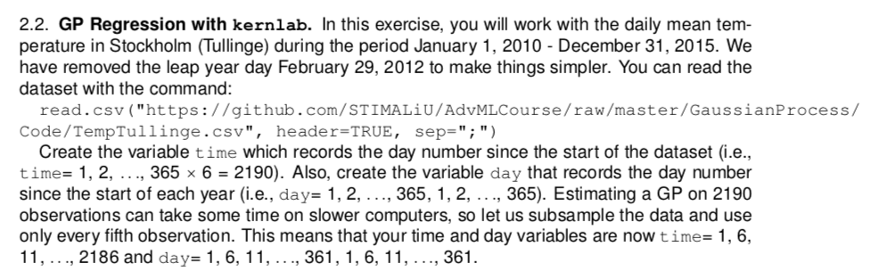
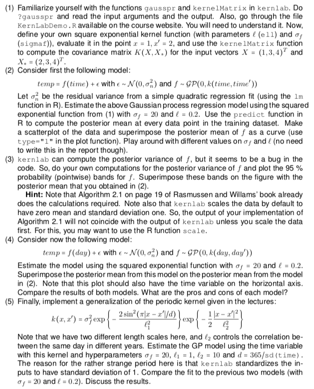
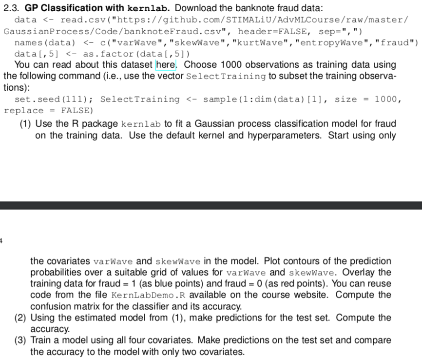

```{r setup, include=TRUE, results='hide', message=FALSE, warning=FALSE}

# Set up general options

knitr::opts_chunk$set(echo = FALSE, warning = FALSE, message = FALSE, 
                      fig.width=6, fig.height=5#, collapse=TRUE
                      )

set.seed(12345)
options(scipen=999)

# General libraries
library(ggplot2)
library(dplyr)

# Specific libaries
library(kernlab)
library(AtmRay)

```

```{r echo = TRUE}

# Auxilary functions
analyze_cm = function(cm, true){
  
  stopifnot(true %in% colnames(cm))
  levels = c(true, colnames(cm)[-which(colnames(cm) == true)]) # ORDER: 1; 0 
  cm = as.data.frame(cm); colnames(cm)[1:2] = c("True", "Pred")
  N = sum(cm$Freq)
  Npos = sum(cm$Freq[which(cm$True == levels[1])])
  Nneg = sum(cm$Freq[which(cm$True == levels[2])])
  TP = sum(cm$Freq[which(cm$True == levels[1] & cm$Pred == levels[1])])
  TN = sum(cm$Freq[which(cm$True == levels[2] & cm$Pred == levels[2])])
  FP = sum(cm$Freq[which(cm$True == levels[2] & cm$Pred == levels[1])])
  
  FN = sum(cm$Freq[which(cm$True == levels[1] & cm$Pred == levels[2])])
  return(data.frame(MCR = (FP+FN)/N, Accuracy = (TP + TN)/N, 
                    Recall = TP/Npos, # recall = TPR = sensitivity,
                    Precision = TP/(TP + FP),
                    FPR = FP/Nneg, TNR = TN/Nneg)) # TNR = specificity
}

# cm = table(Y_true, Y_pred, dnn = c("True", "Predicted"))
# knitr::kable(analyze_cm(cm, true = "yes"))

```

```{r}

# Rstudio guide

## Setup
#```{r setup, include=TRUE, results='hide', message=FALSE, warning=FALSE}
#```

## Appendix
# ```{r, ref.label = knitr::all_labels(), echo = TRUE, eval = FALSE}
#```

## Add image
#```{r label, out.height = "400px", out.width = "800px"}
#knitr::include_graphics("image.png")
#```

## Add image
#

```


***

# Assignment 1: Implementing GP Regression

```{r echo=FALSE}

# ------------------------------------------------------------------------------
# Assignment 1
# ------------------------------------------------------------------------------

```


```{r out.height = "400px", out.width = "500px"}

```


```{r echo=TRUE}

# Utility function for posterior plots
plot_res = function(res, XStar, X, y){
  
  ul = res$mean + 1.96 * sqrt(res$variance)
  ll = res$mean - 1.96 * sqrt(res$variance)
  
  plot(XStar, res$mean, ylim = c(min(ll, y), max(ul, y)), type = "l", 
       col = "forestgreen",
       main = "Mean (green) with CI (blue) and Data (black)")
  points(X, y, col = "black", pch = 16)
  lines(XStar, ul, col = "steelblue4")
  lines(XStar, ll, col = "steelblue4")
    
}

```


## 1: posteriorGP

Below, the function `posteriorGP` for simulating from the posterior
distribution of `f` is implemented with the squared exponential kernel.


```{r echo=TRUE}

# Covariance function: Squared Exp. Kernel
my_kernel = function(x, y, sigmaF, l){
  
  K = matrix(NA, length(x), length(y))
  for (i in 1:length(x)){
    K[i, ] = sigmaF^2 * exp(-0.5*(x[i] - y)^2 / l^2)
  }
  return(K)

}


```

```{r echo=TRUE}

# Function to simulate from the posterior
posteriorGP = function(X, y, XStar, hyperParam, sigmaNoise){
  
  # ------------------------------------------------------------------------
  # Inputs: 
  # X: Vector of training inputs.
  # y: Vector of training targets/outputs.
  # XStar: Vector of inputs where the posterior distribution is evaluated
  # hyperParam: Vector with two elements, sigma_f and l.
  # sigmaNoise: Noise standard deviation sigma_n
  #
  # Outputs: 
  # mean: a vector with the posterior means for fStar
  # variance: a vector with the posterior variances of fStar
  # llh_marginal: a scalar with the marginal log likelihood
  # ------------------------------------------------------------------------
 
  # Initialize params
  n = length(y)
  sigmaf = hyperParam[1]
  l = hyperParam[2]
  K = my_kernel(X, X, sigmaf, l)
  KStar = my_kernel(X, XStar, sigmaf, l)
  
  # Conduct computations
  L = t(chol(K + sigmaNoise^2 * diag(nrow(K))))
  alpha = solve(t(L), solve(L, y))
  fStar = t(KStar) %*% alpha
  v = solve(L, KStar)
  V_fStar = my_kernel(XStar, XStar, sigmaf, l) - t(v) %*% v
  llh_marginal = -1/2 * t(y) %*% alpha - sum(log(L[row(L) == col(L)])) - n/2 * log(2*pi)
    
  # Return results
  return(list(mean = as.numeric(fStar), 
              variance = V_fStar[row(V_fStar) == col(V_fStar)], 
              llh_marginal = as.numeric(llh_marginal)))
}


```

## 2: Prior Update with 1 observation

Here, the prior hyperparameters are updated with 1 single observation. We can
see that the posterior mean (green) goes through this observation as expected.
Furthermore, the credible interval near the observation is much thinner obviously.

```{r echo=TRUE}

# Parmaters
hyperParam = c(1, 0.3) # sigmaf, l
sigmaNoise = 0.1

# Observation
X = 0.4
y = 0.719

# Test points
XStar = seq(-1, 1, 0.1)

# Compute posterior
res = posteriorGP(X, y, XStar, hyperParam, sigmaNoise)

# Visualization of Posterior
plot_res(res, XStar, X, y)

```


## 3: Prior Update with 2 observations

Here, the prior hyperparameters are updated with another observation. Again, the 
posterior mean (green) also goes through this second observation as expected.
Furthermore, the credible interval near the new observation is much thinner obviously.

```{r echo=TRUE}

# Parmaters
hyperParam = c(1, 0.3) # sigmaf, l
sigmaNoise = 0.1

# Observation
X = c(0.4, -0.6)
y = c(0.719, -0.044)

# Test points
XStar = seq(-1, 1, 0.1)

# Compute posterior
res = posteriorGP(X, y, XStar, hyperParam, sigmaNoise)

# Visualization of Posterior
plot_res(res, XStar, X, y)

```


## 4: Prior Update with 5 observations

With five observations, the posterior mean clearly takes a smooth and non-linear
shape. One can see that the posterior mean also seems reasonable for intervals
betwen the observed data points.

```{r echo=TRUE}

# Parmaters
hyperParam = c(1, 0.3) # sigmaf, l
sigmaNoise = 0.1

# Observation
X = c(-1, -0.6, -0.2, 0.4, 0.8)
y = c(0.768, -0.044, -0.94, 0.719, -0.664)

# Test points
XStar = seq(-1, 1, 0.1)

# Compute posterior
res = posteriorGP(X, y, XStar, hyperParam, sigmaNoise)

# Visualization of Posterior
plot_res(res, XStar, X, y)
```


## 5: Prior Update with 5 observations (large l)

Here, we increase the parameter `l` from 0.3 to 1. We can see that the mean is 
much smoother than in the previous task (and correspondingly the credible bands 
as well). This is expected since the parameter `l` regulates the smoothness of 
the function, where a larger `l` corresponds to more smoothness (i.e. less flexibility).

It is visible that the posterior mean does not go through all data points anymore. 
Since we would might this to be the case, we could argue that the value `l=1` is
too large. A smaller value might be better to allow for some more flexibility.

```{r echo=TRUE}

# Parmaters
hyperParam = c(1, 1) # sigmaf, l
sigmaNoise = 0.1

# Observation
X = c(-1, -0.6, -0.2, 0.4, 0.8)
y = c(0.768, -0.044, -0.94, 0.719, -0.664)

# Test points
XStar = seq(-1, 1, 0.1)

# Compute posterior
res = posteriorGP(X, y, XStar, hyperParam, sigmaNoise)

# Visualization of Posterior
plot_res(res, XStar, X, y)


```


# Assignment 2: GP Regression with kernlab

```{r echo=FALSE}

# ------------------------------------------------------------------------------
# Assignment 2
# ------------------------------------------------------------------------------
```


```{r out.height = "400px", out.width = "500px"}

```

```{r out.height = "400px", out.width = "500px"}

```


```{r echo=TRUE}

# Data import
df = read.csv2("input/TempTullinge.csv")

# Add variables
df$time = 1:nrow(df)
df$day = rep(1:365, 6)
df$temp = as.numeric(as.character(df$temp))

# Subset to every 5th obs.
df = df[seq(1, nrow(df), 5), ]

# Show data set
head(df)
tail(df)

```


## 1: Kernel Function and Kernel Matrix

We are going to use the following functions:

```{r echo=TRUE}

?kernlab::gausspr
?kernlab::kernelMatrix

```

**Square Exponential Kernel Function**

Instead of using `rfbdot` (as `kernel` parameter for `gausspr`), we are supposed to define our own square exponential function. The square exponential function was defined as follows in the lecture:

$$k(\textbf{x}, \textbf{x}') = \operatorname{cov}(f(\textbf{x}), f(\textbf{x}')) = \sigma_f^2 \operatorname{exp}\left(-\frac{||\textbf{x} - \textbf{x}'||^2}{2l^2}\right)$$

Note that this function returns a matrix of dimensions: `length(x) x length(y)`, 
where x and y can have different lengths. Every row represents an entry of x
and every column represents an entry for y. Also note that we define a function
that returns a function (i.e. a closure) since this is required so that we can
use the kernel with `gausspr`.

```{r echo=TRUE}

# Define closure (needed for gausspr)
SquaredExpKernel = function(sigmaF, l){
  kernel  = function(x, y){
    
    K = matrix(NA, length(x), length(y))
    for (i in 1:length(x)){
      K[i, ] = sigmaF^2 * exp(-0.5*(x[i] - y)^2 / l^2)
    }
    return(K)
  }
  
  class(kernel) = "kernel" # needed for 
  return(kernel)
}

```

Here, we conduct a quick comparison of the results we get when applying the
own implementation of the squared exponential kernel with R's equivalent 
implementation `rbfdot`. Ideally, we expect both to give the same results, which
is indeed the case.

```{r echo = TRUE}

# Take hyperparams from KernLabDemo.R
l = 1
sigmaF = 1

# Modify rbfdot kernel with hyperparameter
SE_kernel_rbfdot = rbfdot(sigma = 1/(2*l^2))
SE_kernel = SquaredExpKernel(sigmaF = 1, l = 1)

# Example
# SquaredExpKernel(x1 = c(2, 4), x2 = 1) # 2x1
SE_kernel(x = 1, y = 2) 
SE_kernel_rbfdot(1, 2)

```

**Covariance matrix with `kernelMatrix`**

Here, we create a covariance matrix with the square exponential Kernel for two
input vectors `X` and `XStar`. Again, we can see that the resulting covariance
matrix is the same for `rbfdot` and for our implementation.

```{r echo=TRUE}

X = c(1, 3, 4)
XStar = c(2, 3, 4)
kernelMatrix(kernel = SE_kernel, x = X, y = XStar)
kernelMatrix(kernel = SE_kernel_rbfdot, x = X, y = XStar)

```

## 2: GP Regression and Prediction (based on `time`)

Here, we estimate the following Gaussian process regression model: 

$temp=f(time)+\epsilon$ with $\epsilon \sim N(0,\sigma_n^2)$ and $f \sim GP(0,k(time,time'))$


Playing around with the parameters `sigmaF` and `l` led to the following insights:

- Increasing `sigmaF` (e.g. from 20 to 200) does not noticeably change the results. I.e. the predicted means look very similar.
- Decreasing `sigmaF` (e.g. from 20 to 2) decreases the variance of the means s.t. the mean curve does not fit the data anymore. The mean will go up and down when the temperature in the data goes up and down respectively. However, the mean won't go up and down enough to get close to the data points.
- Decreasing `l` (e.g.from 0.2 to 0.02) lets the mean oscillate slightly (unnecessarily). It will seem as if noise was added at some time points. Overall, the mean values still fit the data well.
- Increasing `l` (e.g. from 0.2 to 2) results in mean values that resemble almost a linear line. I.e. the mean values are too smooth and do not fit the data well.

```{r echo=TRUE}

# Update SE_Kernel mit given parameters (for later)
SE_kernel = SquaredExpKernel(sigmaF = 20, l = 0.2)

# Find sigmaNoise 
res = lm(temp ~ time + I(time^2), df)
sigmaNoise = sd(res$residuals)

# Fit the GP with built in Square expontial kernel (called rbfdot in kernlab)
res = gausspr(temp ~ time, data = df, kernel = SquaredExpKernel, 
                 kpar = list(sigmaF = 20, l = 0.2), var = sigmaNoise^2)

plot(df$time, df$temp, main = "Data with GP Posterior Mean (orange)") 
meanPred = predict(res, df) # Predicting the training data. To plot the fit.
lines(df$time, meanPred, col="orange", lwd = 3)


```

## 3: Adding Credible Intervals for Mean and Points

Here, we add credible intervals for the posterior means (dark blue) and the 
data points (light blue).

```{r echo=TRUE}

# Find sigmaNoise 
res = lm(temp ~ time + I(time^2), df)
sigmaNoise = sd(res$residuals)

# Fit the GP with built in Square expontial kernel (called rbfdot in kernlab)
res = gausspr(temp ~ time, data = df, kernel = SquaredExpKernel, 
                 kpar = list(sigmaF = 20, l = 0.2), var = sigmaNoise^2)

plot(df$time, df$temp, ylim = c(-40, 40), 
     main = "Data with GP Posterior Mean (orange)
95% CI for Mean (blue) and for Data Points (lightblue)")
meanPred = predict(res, df) # Predicting the training data. To plot the fit.
lines(df$time, meanPred, col="orange", lwd = 3)

# Probability and prediction interval implementation.
# Note: Scaling required since mean was automatically scaled by kernlab as well.
x = scale(df$time) # 
xs = scale(df$time) # XStar
n = length(x)
Kss = kernelMatrix(kernel = SE_kernel, x = xs, y = xs)
Kxx = kernelMatrix(kernel = SE_kernel, x = x, y = x)
Kxs = kernelMatrix(kernel = SE_kernel, x = x, y = xs)
Covf = Kss-t(Kxs)%*%solve(Kxx + sigmaNoise^2*diag(n), Kxs) # Covariance matrix of fStar

# Probability intervals for fStar
lines(df$time, meanPred - 1.96*sqrt(diag(Covf)), col = "steelblue4", lwd = 2)
lines(df$time, meanPred + 1.96*sqrt(diag(Covf)), col = "steelblue4", lwd = 2)

# Prediction intervals for yStar
lines(df$time, meanPred - 1.96*sqrt((diag(Covf) + sigmaNoise^2)), col = "steelblue2")
lines(df$time, meanPred + 1.96*sqrt((diag(Covf) + sigmaNoise^2)), col = "steelblue2")


```

## 4: GP Regression and Prediction (based on `day`)

Here, we repeat the task from step 2. But this time, however, we use `day`
as predictive variable (instead of the `time`). We still plot the `time` on the
x-axis so that we can compare the results.

We can see that the resulting means and credible bands are not as smooth as before.
Moreover, there are more points that lie outside the lightblue credible bands (that are meant
for the points). Nevertheless, we still have to say that the results are quite
good after all. We can conclude that the temperature can largely be predicted 
based on the day in the year. The exact date may not be necessary for the temperature
prediction because there is e.g. no strong trend across the years.

**Pros**

- With only `day` as covariate, the model has higher simplicity.
- With only `day` as covariate, the model might generalize better to the future. This is so because the model is more general, only using the day in the year instead of the exact date.

**Cons**

- With only `day` as covariate, the differences between years may not be modelled/predicted appropriately. I.e. if there was a trend across years, the `day` covariate would not be sufficient.

```{r echo = TRUE}

# Find sigmaNoise 
res = lm(temp ~ day + I(day^2), df)
sigmaNoise = sd(res$residuals)

# Fit the GP with built in Square expontial kernel (called rbfdot in kernlab)
res = gausspr(temp ~ day, data = df, kernel = SquaredExpKernel, 
                 kpar = list(sigmaF = 20, l = 0.2), var = sigmaNoise^2)

plot(df$time, df$temp, ylim = c(-40, 40), 
     main = "Data with GP Posterior Mean (orange)
95% CI for Mean (blue) and for Data Points (lightblue)")
meanPred = predict(res, df) # Predicting the training data. To plot the fit.
lines(df$time, meanPred, col="orange", lwd = 3)

# Probability and prediction interval implementation.
# Note: Scaling required since mean was automatically scaled by kernlab as well.
x = scale(df$day) # 
xs = scale(df$day) # XStar
n = length(x)
Kss = kernelMatrix(kernel = SE_kernel, x = xs, y = xs)
Kxx = kernelMatrix(kernel = SE_kernel, x = x, y = x)
Kxs = kernelMatrix(kernel = SE_kernel, x = x, y = xs)
Covf = Kss-t(Kxs)%*%solve(Kxx + sigmaNoise^2*diag(n), Kxs) # Covariance matrix of fStar

# Probability and prediction interval implementation.
# Note: Scaling required since mean was automatically scaled by kernlab as well.
x = scale(df$day) # 
xs = scale(df$day) # XStar
n = length(x)
Kss = kernelMatrix(kernel = SE_kernel, x = xs, y = xs)
Kxx = kernelMatrix(kernel = SE_kernel, x = x, y = x)
Kxs = kernelMatrix(kernel = SE_kernel, x = x, y = xs)
Covf = Kss-t(Kxs)%*%solve(Kxx + sigmaNoise^2*diag(n), Kxs) # Covariance matrix of fStar

# Probability intervals for fStar
lines(df$time, meanPred - 1.96*sqrt(diag(Covf)), col = "steelblue4", lwd = 2)
lines(df$time, meanPred + 1.96*sqrt(diag(Covf)), col = "steelblue4", lwd = 2)

# Prediction intervals for yStar
lines(df$time, meanPred - 1.96*sqrt((diag(Covf) + sigmaNoise^2)), col = "steelblue2")
lines(df$time, meanPred + 1.96*sqrt((diag(Covf) + sigmaNoise^2)), col = "steelblue2") 

```


## 5: Periodic Kernel

Here, we implement a generalization of the periodic kernel (see screenshot above 
for the formula) and fit another Gaussian process regression model, this time
again using the `time` variable. 

The resulting posterior mean and credible bands seem to resemble the results from
the model in 1.2 (with `time`) very closely. In other words, the result is better
than the result from 1.3 (with `day`). This is so, because there are no unnecessary
oscillations visible and the credible intervals also seem to include all data points.

Considering the 2 used kernels (only with `time`), we could say that the...

**squared exponential kernel** 

- is better if we prefer simplicity (and don't want to set additional parameters `d` and `l2`)
- is better if there is no actual periodicity

**periodic kernel** 

- is better if we prefer more control over certain parameters e.g. `d` and `l2`
- is appropriate if there is periodicity


```{r echo = TRUE}

# Define closure (needed for gausspr)
PeriodicKernel = function(sigmaF, l1, l2, d){
  
  kernel  = function(x, y){
    
    K = matrix(NA, length(x), length(y))
    
    for (i in 1:length(x)){
      K[i, ] = sigmaF^2 * exp(-2 * sin(pi*abs(x[i] - y)/d)^2 / l1^2) *
                          exp(-0.5 * (x[i] - y)^2 / l2^2) 
    }
    return(K)
    
  }
  
  class(kernel) = "kernel" # needed for 
  return(kernel)
}


```


```{r}

# Find sigmaNoise 
res = lm(temp ~ time + I(time^2), df)
sigmaNoise = sd(res$residuals)

# Fit the GP with built in Square expontial kernel (called rbfdot in kernlab)
res = gausspr(temp ~ time, data = df, kernel = PeriodicKernel, 
              kpar = list(sigmaF = 20, l1 = 1, l2 = 10, d = 365/sd(df$time)), 
              var = sigmaNoise^2)

plot(df$time, df$temp, ylim = c(-40, 40), 
     main = "Data with GP Posterior Mean (orange)
95% CI for Mean (blue) and for Data Points (lightblue)")
meanPred = predict(res, df) # Predicting the training data. To plot the fit.
lines(df$time, meanPred, col="orange", lwd = 3)

# Probability and prediction interval implementation.
# Note: Scaling required since mean was automatically scaled by kernlab as well.
x = scale(df$time) # 
xs = scale(df$time) # XStar
n = length(x)
Kss = kernelMatrix(kernel = SE_kernel, x = xs, y = xs)
Kxx = kernelMatrix(kernel = SE_kernel, x = x, y = x)
Kxs = kernelMatrix(kernel = SE_kernel, x = x, y = xs)
Covf = Kss-t(Kxs)%*%solve(Kxx + sigmaNoise^2*diag(n), Kxs) # Covariance matrix of fStar

# Probability and prediction interval implementation.
# Note: Scaling required since mean was automatically scaled by kernlab as well.
x = scale(df$time) # 
xs = scale(df$time) # XStar
n = length(x)
Kss = kernelMatrix(kernel = SE_kernel, x = xs, y = xs)
Kxx = kernelMatrix(kernel = SE_kernel, x = x, y = x)
Kxs = kernelMatrix(kernel = SE_kernel, x = x, y = xs)
Covf = Kss-t(Kxs)%*%solve(Kxx + sigmaNoise^2*diag(n), Kxs) # Covariance matrix of fStar

# Probability intervals for fStar
lines(df$time, meanPred - 1.96*sqrt(diag(Covf)), col = "steelblue4", lwd = 2)
lines(df$time, meanPred + 1.96*sqrt(diag(Covf)), col = "steelblue4", lwd = 2)

# Prediction intervals for yStar
lines(df$time, meanPred - 1.96*sqrt((diag(Covf) + sigmaNoise^2)), col = "steelblue2")
lines(df$time, meanPred + 1.96*sqrt((diag(Covf) + sigmaNoise^2)), col = "steelblue2") 


```


# Assignment 3: GP Classification with kernlab

```{r echo=FALSE}

# ------------------------------------------------------------------------------
# Assignment 3
# ------------------------------------------------------------------------------
```

```{r out.height = "400px", out.width = "500px"}

```

First, the data is imported and split into training and test data.

```{r echo=TRUE}

# Data import
df = read.csv('input/banknoteFraud.csv', header = FALSE)
names(df) = c("varWave","skewWave","kurtWave","entropyWave","fraud") 
df[,5] = as.factor(df[,5])

# Split data
set.seed(111)
idx_tr = sample(1:dim(df)[1], size = 1000, replace = FALSE)
df_tr = df[idx_tr, ]
df_te = df[-idx_tr, ]

head(df_tr)

```

## 1: GP Classification (2 covariates)

GP Classification is performed with the 2 covariates `varWave` and `skewWave`. 
The accuracy on the training data and the corresponding confusion matrix is
printed out below. We can conclude that the fit is quite good.

```{r echo=TRUE}

# Set parameters, fit model
classname = "fraud"
classvals = c(0, 1)
varnames = c("varWave", "skewWave")
res = gausspr(fraud ~ varWave + skewWave, data = df_tr)

# Confusion matrix
cm = table(predict(res, df_tr[,colnames(df_tr) %in% varnames]), # predicted
      df_tr[["fraud"]], dnn = c("pred", "true")) # true
cm
knitr::kable(analyze_cm(cm, true = "1"))

# Create plot
probs = predict(res, df_tr[,colnames(df_tr) %in% varnames], type="probabilities")
x1 = seq(min(df_tr[[varnames[1]]]),max(df_tr[[varnames[1]]]),length=100)
x2 = seq(min(df_tr[[varnames[2]]]),max(df_tr[[varnames[2]]]),length=100)
gridPoints = meshgrid(x1, x2)
gridPoints = cbind(c(gridPoints$x), c(gridPoints$y))
gridPoints = data.frame(gridPoints)
names(gridPoints) = varnames
probs = predict(res, gridPoints, type="probabilities")

# Plotting for Prob (classval 1). Note: Add more points for more classes
contour(x1,x2,matrix(probs[,colnames(probs) == classvals[1]],100,byrow = TRUE), 
        20, xlab = varnames[1], ylab = varnames[2], 
        main = paste0('Prob(class=', classvals[1],') [in red]'))
points(df_tr[[varnames[1]]][df_tr[[classname]]==classvals[1]],
       df_tr[[varnames[2]]][df_tr[[classname]]==classvals[1]], col="red")
points(df_tr[[varnames[1]]][df_tr[[classname]]==classvals[2]],
       df_tr[[varnames[2]]][df_tr[[classname]]==classvals[2]], col="blue")

# Plotting for Prob (classval 2). Note: Add more points for more classes
contour(x1,x2,matrix(probs[,colnames(probs) == classvals[2]],100,byrow = TRUE), 
        20, xlab = varnames[1], ylab = varnames[2], 
        main = paste0('Prob(class=', classvals[2],') [in blue]'))
points(df_tr[[varnames[1]]][df_tr[[classname]]==classvals[1]],
       df_tr[[varnames[2]]][df_tr[[classname]]==classvals[1]], col="red")
points(df_tr[[varnames[1]]][df_tr[[classname]]==classvals[2]],
       df_tr[[varnames[2]]][df_tr[[classname]]==classvals[2]], col="blue")

```

## 2: Evaluation on Test Data (2 covariates)

Evaluated on the test data, we can see that the accuracy is even slightly better
than for the training data. Hence, we can conclude that the model generalizes
very well to new data from the same origin.

```{r echo = TRUE}

# Confusion matrix
cm = table(predict(res, df_te[,colnames(df_te) %in% varnames]), # predicted
      df_te[["fraud"]], dnn = c("pred", "true")) # true
cm
knitr::kable(analyze_cm(cm, true = "1"))

```

## 3: GP Classification and Evaluation (4 covariates)

Here, we use all 4 covariates instead of only 2. We can see that the performance 
on the test data improves noticeably by approx. 6 percent points. Obviously, the 
additional 2 covariates also provide useful information for classification. 

```{r echo = TRUE}

# Set parameters, fit model
classname = "fraud"
classvals = c(0, 1)
varnames = c("varWave", "skewWave", "kurtWave", "entropyWave")
res = gausspr(fraud ~ varWave + skewWave + kurtWave + entropyWave, data = df_tr)

# Confusion matrix
cm = table(predict(res, df_te[,colnames(df_te) %in% varnames]), # predicted
      df_te[["fraud"]], dnn = c("pred", "true")) # true
cm
knitr::kable(analyze_cm(cm, true = "1"))

```


# Appendix

```{r, ref.label = knitr::all_labels(), echo = TRUE, eval = FALSE}
```
